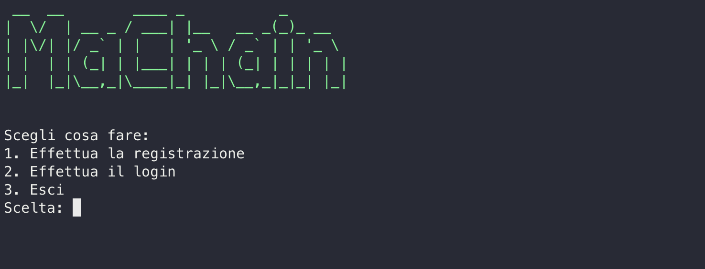

# ProgettoSSB

Repository per il progetto di **Software Security and Blockchain**.

La presente relazione fornisce una guida completa all'uso dell'applicazione e illustra i passaggi necessari per configurare correttamente l'ambiente e avviare il programma.

# Guida all'uso

Questi sono i passaggi necessari per poter utilizzare la nostra app.

## 1. Installazione di Docker

Prima di iniziare, è necessario assicurarsi di avere Docker installato sul proprio computer. Docker fornisce un ambiente isolato per eseguire applicazioni in contenitori, garantendo la portabilità e la sicurezza dei componenti del progetto. È possibile scaricare il file di installazione di Docker al seguente [link](https://www.docker.com/).

## 2. Git clone

Il passo successivo consiste nello scaricare il file ‘\_docker-compose.ym_l’ dal repository del progetto. Puoi ottenerlo navigando a questo [link](https://downgit.github.io/#/home?url=https://github.com/Antonet99/ProgettoSSB/blob/master/docker-compose.yaml) o a questo [link](https://raw.githubusercontent.com/Antonet99/ProgettoSSB/master/docker-compose.yaml).

Una volta ottenuto e salvato il file sul desktop personale, è possibile procedere con i passaggi successivi.

## 3. Deploy delle blockchain

La configurazione e il deploy delle blockchain Ethereum sono fondamentali per il corretto funzionamento dell'applicazione. Il file ‘_docker-compose.yml_’ contiene tutte le informazioni, le dipendenze e le impostazioni necessarie per effettuare il deploy delle blockchain, che verranno create in locale sulla propria macchina attraverso il Ganache.

Per iniziare, aprire una finestra del terminale del proprio computer e posizionarsi nella directory dove è stato salvato il file ‘_docker-compose.yml_’ (ad esempio Desktop). A questo punto, è sufficiente eseguire il seguente comando:

    docker compose up -d

Questo comando avvierà il processo di creazione e avvio dei contenitori Docker necessari per ospitare le blockchain Ethereum.

## 4. Deploy del programma

Una volta completato correttamente il deploy delle blockchain, è possibile procedere con il deploy del programma principale dell'applicazione. Assicurarsi di trovarsi nella stessa directory in cui è stato eseguito il comando precedente e digitare il seguente comando nel terminale:

    docker run -ti --network="blockchain" --name maChain --publish 8089:8089 andreaciv/progetto_ssb_gruppo_3

Questo comando avvierà il processo di deploy del programma, creando un contenitore Docker denominato "**maChain**", la cui porta 8989 sarà esposta in ascolto sulla rete locale e che sarà in grado di comunicare con le blockchain precedentemente configurate.

## 5. Apertura del programma

A questo punto, il programma è pronto per essere utilizzato. Dopo aver eseguito il precedente comando con successo, è possibile interagire con l'applicazione tramite il terminale che si aprirà a deploy effettuato.

## 6. Apertura del programma

Alla prima esecuzione del programma, viene effettuato un controllo dall’applicazione per verificare i tre requisiti riportati nella descrizione dell’architettura dell’applicazione.

Se non ci sono errori e sono verificati questi requisiti, si può iniziare ad utilizzare il programma.

## 7. Utilizzo del programma

Al primo avvio in assoluto del programma, verrà attuato il meccanismo di controllo dell'applicazione per verificare che i tre requisiti riportati nella descrizione dell'architettura dell'applicazione siano soddisfatti. Se non ci sono errori e i requisiti sono soddisfatti, è possibile iniziare ad utilizzare il programma.

Terminato il bootstrap con il deploy dell'on-chain manager, si aprirà la schermata principale dell'applicazione, che permette di scegliere se effettuare il login o la registrazione.

Selezionando la seconda opzione relativa al login, il programma chiedere all'utente di inserire il proprio username e la propria password. Se i dati inseriti sono corretti, verrà visualizzato un messaggio di conferma e si aprirà il menu principale dell'applicazione.

Selezionando invece la prima opzione, in fase di registrazione verrà richiesto di inserire uno username e una password, oltre alle quattro chiavi corrispondenti al proprio account sulle 4 blockchain deployate. Se l'username è già presente nel database, verrà visualizzato un messaggio di errore che invita l'utente a inserire uno username diverso. In caso contrario, verrà creato un nuovo utente e verrà visualizzato un messaggio di conferma.

Effettuato il login nell'applicazione, si aprirà il menu principale, che permette di scegliere tra le seguenti opzioni:

Tramite l'opzione 1 è possibile procedere al deploy di uno smart contract. Selezionando questa opzione, verrà chiesto all'utente di inserire il percorso del file .sol contenente lo smart contract da deployare. Se il percorso inserito è corretto, verrà visualizzato un messaggio di conferma e verrà effettuato il deploy dello smart contract. In caso contrario, verrà visualizzato un messaggio di errore che invita l'utente a riprovare.

Per procedere invece con l'opzione 2, è necessario aver già effettuato il deploy. Se il deploy è stato effettuato correttamente, verrà visualizzato un messaggio di conferma e si aprirà il menu relativo alla gestione dello smart contract.

## Conclusioni

Questi esempi mostrano come sia possibile utilizzare l'applicazione per interagire con le blockchain Ethereum locali in modo sicuro e protetto. L'applicazione è stata progettata per essere semplice e intuitiva, in modo da poter essere utilizzata anche da utenti meno esperti, e sopratutto per essere facilmente utilizzabile con i propri smart contract e modificabile in futuro.

## Test del programma

Sono stati effettuati dei test per verificare il corretto funzionamento dell'applicazione. I test sono stati effettuati seguendo la guida all'uso del programma, utilizzando Docker Desktop e il terminale, in modo da ricreare le stesse condizioni e lo stesso ambiente di utilizzo dell'applicazione.

Ad esempio, la prima prova effettuata consisteva nell'avviare soltanto il programma senza aver effettuato il deploy delle shard. L'errore è gestito correttamente dall'applicazione, che visualizza un messaggio di errore e invita l'utente a effettuare la connessione alle blockchain.

Un altro test effettuato prevedeva il login senza nessun account registrato. Anche in questo caso, l'errore è gestito correttamente dall'applicazione, che visualizza un messaggio di errore e invita l'utente a registrarsi.

Quando non ci sono smart contract deployati, l'applicazione visualizza un messaggio di errore e invita l'utente a procedere con il deploy di uno smart contract.

Ancora, vengono testati sia l'inserimento da parte dell'utente di un path errato per il file .sol da deployare, sia l'inserimento di un path corretto ma di un file che non contiene uno smart contract. In entrambi i casi, l'errore è gestito correttamente dall'applicazione, che visualizza un messaggio di errore e invita l'utente a riprovare.

Grazie a queste fasi di test, è stato possibile verificare il corretto funzionamento dell'applicazione e la gestione degli errori da parte del programma.
