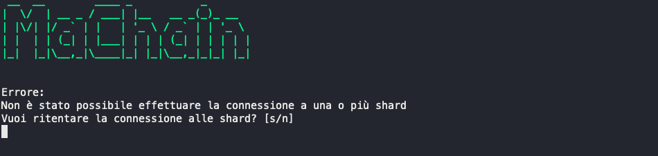

# MaChain, a local Ethereum blockchain

Repository for the **Software Security and Blockchain** project.

This report provides a complete guide on how to use the application and explains the necessary steps to configure the environment correctly and start the program.

# User Guide

These are the necessary steps to use our app.

## 1. Installing Docker

Before getting started, make sure you have Docker installed on your computer. Docker provides an isolated environment to run applications in containers, ensuring the portability and security of project components. You can download the Docker installation file from the following [link](https://www.docker.com/).

## 2. Git Clone

The next step is to download the file '_docker-compose.yaml_' from the project repository. You can obtain it by navigating to this [link](https://downgit.github.io/#/home?url=https://github.com/Antonet99/ProgettoSSB/blob/master/docker-compose.yaml) or this [link](https://raw.githubusercontent.com/Antonet99/ProgettoSSB/master/docker-compose.yaml).

Once you have obtained and saved the file to your personal desktop, you can proceed with the following steps.

## 3. Deploying the Blockchains

Configuring and deploying Ethereum blockchains is essential for the correct operation of the application. The '_docker-compose.yaml_' file contains all the information, dependencies, and settings required to deploy the blockchains, which will be created locally on your machine through Ganache.

To start, open a terminal window on your computer and navigate to the directory where the '_docker-compose.yaml_' file was saved (e.g., Desktop). At this point, simply run the following command:

    docker compose up -d

This command will initiate the process of creating and starting the Docker containers required to host the Ethereum blockchains.

## 4. Deploying the Program

Once you have successfully completed the deployment of the blockchains, you can proceed with deploying the main application program. Ensure that you are in the same directory where the previous command was executed and enter the following command in the terminal:

    docker run -ti --network="blockchain" --name maChain --publish 8089:8089 andreaciv/progetto_ssb_gruppo_3

This command will start the program deployment process, creating a Docker container named "**maChain**." Port 8989 of this container will be exposed and listening on the local network, allowing it to communicate with the previously configured blockchains.

## 5. Opening the Program

At this point, the program is ready to be used. After executing the previous command and successfully deploying the entire infrastructure, you can interact with the application through the terminal that opens after deployment.

## 6. Using the Program

Upon the very first startup of the program, it will perform an application check mechanism to verify that the three requirements mentioned in the application architecture description are met. If there are no errors, and the requirements are satisfied, you can begin using the program.

After the bootstrap phase with the on-chain manager deployed, the main screen of the application will open, allowing you to choose between logging in or registering.

By selecting the second option for login, the program will prompt the user to enter their username and password. If the provided data is correct, a confirmation message will be displayed, and the application's main menu will open.

Choosing the first option, during registration, you will be asked to enter a username and a password, along with four keys corresponding to your account on the four deployed blockchains. If the username is already present in the database, an error message will be displayed, prompting the user to enter a different username. Otherwise, a new user will be created, and a confirmation message will be displayed.

Once logged in to the application, the main menu will open, allowing you to choose from the following options:

Option 1 allows you to proceed with deploying a smart contract. Selecting this option will prompt you to enter the path to the .sol file containing the smart contract to be deployed. If the entered path is correct, a confirmation message will be displayed, and the smart contract will be deployed. Otherwise, an error message will be displayed, inviting the user to try again.

To proceed with option 2, you must have already completed the deployment. If deployment was successful, a confirmation message will be displayed, and the smart contract management menu will open.

## Conclusions

These examples demonstrate how it is possible to use the application to interact with local Ethereum blockchains securely and safely. The application has been designed to be simple and intuitive, making it usable even by less experienced users and, most importantly, easily adaptable for future use with your smart contracts.

## Test

Tests were conducted to verify the correct operation of the application. The tests were carried out following the program's user guide, using Docker Desktop and the terminal, to recreate the same conditions and usage environment of the application.

For example, the first test involved starting the program without deploying the shards. The error is handled correctly by the application, which displays an error message and prompts the user to connect to the blockchains.

Another test involved logging in without any registered account. In this

 case, too, the error is handled correctly by the application, which displays an error message and invites the user to register.

When there are no deployed smart contracts, the application displays an error message and invites the user to proceed with deploying a smart contract.

Furthermore, tests were conducted to check user input, such as entering an incorrect path for the .sol file to deploy or entering the correct path but a file that does not contain a smart contract. In both cases, the error is handled correctly by the application, which displays an error message and invites the user to try again.

Thanks to these testing phases, it was possible to verify the correct operation of the application and the program's error handling capabilities.
